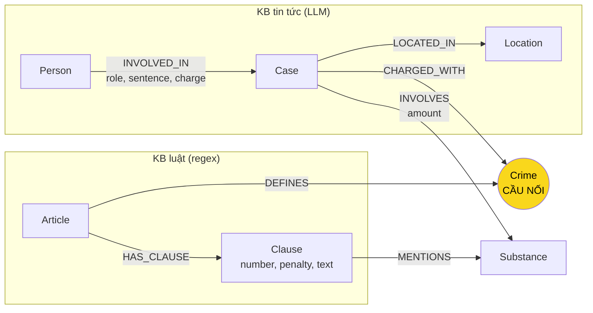

# Thiết kế Ontology — Day 19

**Họ tên:** Nguyễn Thị Hải Mi  **MSSV:** 2A202602667

**Lựa chọn** (đánh dấu một):
- [x] Dùng ontology gợi ý (có thể chỉnh nhỏ)
- [ ] Tự thiết kế (xét bonus +15, xem `SUBMISSION.md`)

> Hướng dẫn: `LAB_GUIDE.md` Bước 2. Dùng ontology gợi ý thì vẫn phải điền đủ các mục dưới đây bằng lời của bạn.

## 1. Sơ đồ

Node cầu nối giữa KB luật và KB tin là **`Crime`** (tô vàng). Bên trái là phần lấy từ tin tức, bên phải là phần lấy từ văn bản luật.

`Substance` cũng có mặt ở cả hai phía (vụ án `INVOLVES` chất, khoản luật `MENTIONS` chất), nên là cầu nối phụ để chọn đúng khoản luật theo loại chất.

## 2. Entity types (node labels)

| Label | Ý nghĩa | Khóa định danh (`MERGE` theo) | Properties | Lấy từ KB nào | Trích bằng (regex / LLM / khác) |
| --- | --- | --- | --- | --- | --- |
| `Article` | Một Điều luật (BLHS Điều 247–259, Luật PCMT Điều 1–5) | `id`, ví dụ `"Điều 251 BLHS"` (lấy từ front matter `article`) | `title`, `law`, `doc_id` | Luật | Regex / metadata (`parse_law_article`) |
| `Clause` | Một khoản trong Điều, là nơi chứa khung hình phạt | `id`, ví dụ `"Điều 251 BLHS khoản 4"` | `number`, `penalty` (vd. "phạt tù 20 năm, tù chung thân hoặc tử hình"), `text`, `doc_id` | Luật | Regex `^(\d+)\.\s` tách khoản; regex `bị (phạt…)` lấy mức phạt |
| `Crime` | Tội danh đã chuẩn hóa (cầu nối) | `name`, viết thường, bỏ chữ "Tội ", ví dụ `"mua bán trái phép chất ma túy"` | `name` | Luật (tiêu đề Điều); tin tức chỉ trỏ tới, không tạo tên mới | `normalize_crime` (luật); LLM + `link_entity` (tin) |
| `Substance` | Chất ma túy | `name` theo danh sách chuẩn `SUBSTANCES` (MDMA, Ketamine, Heroine…) | `name` | Cả hai | Khớp chuỗi `find_substances` (luật); LLM chọn từ danh sách chuẩn (tin) |
| `Case` | Một vụ việc được báo nêu (bắt, truy tố, xét xử) | `name` (tên ngắn do LLM đặt) | `summary`, `date`, `doc_id`, `source_title` | Tin | LLM (`extract_news_cases`) |
| `Person` | Bị cáo, bị can, nghi phạm, cán bộ liên quan | `name` (họ tên đầy đủ) | `aliases` (biệt danh, ví dụ "Hoàng Nato") | Tin | LLM |
| `Location` | Tỉnh/thành nơi xảy ra vụ việc | `name` | `name` | Tin | LLM |

Bài tuyên truyền, hội nghị (không có vụ việc cụ thể) không tạo `Case`: prompt yêu cầu LLM trả `{"cases": []}`.

## 3. Relationships

| Type | Từ → Đến | Properties trên cạnh | Ý nghĩa |
| --- | --- | --- | --- |
| `DEFINES` | `Article` → `Crime` | — | Điều luật quy định tội danh này (chỉ các Điều BLHS có tiêu đề "Tội …") |
| `HAS_CLAUSE` | `Article` → `Clause` | — | Điều gồm các khoản |
| `MENTIONS` | `Clause` → `Substance` | — | Khoản có nêu chất này (trong các điểm về khối lượng) |
| `CHARGED_WITH` | `Case` → `Crime` | — | Vụ việc bị truy tố / xét xử về tội này |
| `INVOLVES` | `Case` → `Substance` | `amount` (vd. "hơn 9,6kg") | Vụ việc có thu giữ / liên quan chất này |
| `LOCATED_IN` | `Case` → `Location` | — | Nơi xảy ra vụ việc |
| `INVOLVED_IN` | `Person` → `Case` | `role` (bị cáo / bị can / nghi phạm…), `charge` (tội của riêng người này), `sentence` (vd. "36 tháng tù", "tử hình") | Người có vai trò trong vụ việc, kèm mức án của chính người đó |

## 4. Node cầu nối giữa 2 KB

- **Node nào:** `Crime`.
- **Vì sao chọn node này:** Đọc dữ liệu ở Bước 1, chỉ có 3 thứ xuất hiện ở cả hai KB: tội danh, chất ma túy, hình phạt. Báo không bao giờ ghi số Điều, nhưng luôn viết tội danh gần như nguyên văn tên tội trong luật ("về tội mua bán trái phép chất ma túy" ↔ "Điều 251. Tội mua bán trái phép chất ma túy"). Vì vậy tội danh là đường ngắn và chắc chắn nhất để đi từ vụ án sang Điều luật. Hình phạt không dùng làm cầu được vì án tuyên ("36 tháng") và khung luật ("02 năm đến 07 năm") không bao giờ trùng chữ.
- **Cách đảm bảo hai phía khớp tên:**
  1. Phía luật tạo tên chuẩn bằng `normalize_crime`: bỏ dấu nháy, gộp khoảng trắng, chuyển chữ thường, bỏ tiền tố "tội ".
  2. Prompt trích xuất tin tức đưa sẵn **DANH SÁCH TỘI DANH** lấy từ luật và yêu cầu LLM chọn nguyên văn.
  3. Sau khi LLM trả về, code chạy lại `link_entity` cho mọi tội danh: chuẩn hóa cả hai phía, khớp chính xác trước, rồi khớp gần đúng bằng `difflib` (cutoff 0.8). Không khớp thì trả `None` và **không tạo cạnh** (thà thiếu cạnh còn hơn tạo một `Crime` lạ không nối được sang luật).
  4. Cầu phụ `Substance` dùng cùng cách: danh sách chuẩn `SUBSTANCES` có trong prompt.
- **Khi nào cầu gãy, và bạn xử lý thế nào:**
  - *Bài báo chỉ nói "bị bắt", "điều tra" mà không nêu tội danh* → `Case` không có `CHARGED_WITH`. Xử lý: chấp nhận; bước truy vấn vẫn trả về vụ việc từ tin, LLM trả lời phần tin và nói rõ thiếu căn cứ luật.
  - *Báo viết tội danh khác xa tên luật* (vd. "buôn ma túy") → `difflib` không đạt 0.8, cạnh bị bỏ. Xử lý: ghi nhận ở Bước 8, có thể bổ sung bảng từ đồng nghĩa.
  - *Báo dùng tiếng lóng cho chất* ("kẹo", "thuốc lắc", "nước vui") → LLM có thể không đưa về MDMA, cầu phụ `Substance` gãy. Xử lý: kiểm tra bằng Cypher ở Bước 8 (đếm `Substance` không có `MENTIONS`).

## 5. Competency questions

| Câu | Đường đi (Cypher pattern) | Trả lời được? |
| --- | --- | --- |
| Q1 | `(:Article {id:'Điều 2 Luật PCMT'})-[:HAS_CLAUSE]->(:Clause {number:4})` → đọc `text` ("Tiền chất là hóa chất…") | **Có.** Chỉ cần KB luật, 1 bước. Seed tìm được nhờ `doc_id` của đoạn vector top-k. |
| Q2 | `(:Person)-[r:INVOLVED_IN]->(k:Case)` với `k` là vụ 36kg tại TP.HCM, lọc `r.sentence = 'tử hình'` | **Có.** Chỉ cần KB tin; phụ thuộc LLM điền đúng `sentence` cho từng người. |
| Q3 | `(:Person {name:'Lê Minh Thành'})-[:INVOLVED_IN {sentence}]->(:Case)-[:CHARGED_WITH]->(:Crime)<-[:DEFINES]-(:Article)-[:HAS_CLAUSE]->(:Clause {number:1})` | **Có.** Tên người có trong câu hỏi nên là seed; đi qua cầu `Crime` sang Điều 251 khoản 1 (02–07 năm). |
| Q4 | `(:Person {aliases ∋ 'Hoàng Nato'})-[:INVOLVED_IN]->(:Case)-[:CHARGED_WITH]->(:Crime {name:'tổ chức sử dụng trái phép chất ma túy'})<-[:DEFINES]-(:Article {id:'Điều 255 BLHS'})-[:HAS_CLAUSE]->(:Clause {number:4})` | **Có điều kiện.** Seed khớp được qua `aliases` *nếu* LLM ghi "Hoàng Nato" vào biệt danh của Dương Minh Tuấn. 4 bài báo cùng nói về vụ này; nếu LLM đặt tên `Case` khác nhau ở mỗi bài thì graph có nhiều `Case` trùng nhưng vẫn đi được. |
| Q5 | `(:Person {name:'Cái Quang Huy'})-[:INVOLVED_IN]->(k:Case)-[:CHARGED_WITH]->(:Crime)<-[:DEFINES]-(a:Article {id:'Điều 250 BLHS'})-[:HAS_CLAUSE]->(cl:Clause)-[:MENTIONS]->(:Substance {name:'MDMA'})<-[:INVOLVES {amount}]-(k)` | **Một phần.** Graph lấy được tội, chất, khối lượng ("hơn 9,6kg") và các khoản 2, 3, 4 của Điều 250 cùng nhắc MDMA. Nhưng ontology **không lưu ngưỡng khối lượng** (5g / 30g / 100g) thành dữ liệu có cấu trúc, nên graph không tự chọn được khoản 4; việc so 9,6kg ≥ 100g dồn cho LLM đọc `text` của khoản. Chấp nhận vì tách đến mức Điểm + ngưỡng làm graph lớn và parser phức tạp hơn nhiều. |
| Q6 | `(k:Case)-[:INVOLVES]->(:Substance {name:'MDMA'})` → `RETURN k.name, k.summary` | **Có điều kiện.** Truy vấn tổng hợp là thế mạnh của graph so với top-k. Đúng khi LLM chuẩn hóa chất về "MDMA" ở cả 3 vụ (Cái Quang Huy, Lê Minh Thành, Viện Pháp y tâm thần). Vụ Lê Minh Thành dùng chữ "kẹo" trước khi nêu kết luận giám định MDMA, dễ bị bỏ sót. |

## 6. Quyết định thiết kế và đánh đổi

1. **Mức án là property trên cạnh `INVOLVED_IN`, không phải node `Sentence` riêng.**
   Phương án khác: node `Sentence {years}` nối với `Person` và `Case`.
   Lý do chọn: mức án gắn với đúng một người trong đúng một vụ, không được dùng chung, nên làm node chỉ tăng số bước đi mà không thêm khả năng truy vấn. Cùng lý do, khối lượng là property `amount` trên cạnh `INVOLVES`.

2. **Tách luật đến mức Khoản, chưa tách đến Điểm.**
   Phương án khác: thêm node `Point` (điểm a, b, …) với `substance`, `min_gram`, `max_gram`.
   Lý do chọn: khung hình phạt nằm ở khoản, nên mức Khoản đủ cho Q3, Q4. Đánh đổi: Q5 không chọn được khoản bằng truy vấn mà phải để LLM so khối lượng (xem mục 5 và 8).

3. **Luật trích bằng regex, tin tức trích bằng LLM.**
   Phương án khác: dùng LLM cho cả hai KB.
   Lý do chọn: văn bản luật có cấu trúc rất đều ("Điều N.", "1.", "thì bị phạt tù…"), regex cho kết quả chính xác, lặp lại được và không tốn tiền gọi API. Báo viết tự do nên cần LLM. Nhờ vậy chi phí dựng graph chỉ tính cho ~20 bài báo.

4. **`Crime` lấy tên từ luật, tin tức chỉ được trỏ tới tên có sẵn.**
   Phương án khác: để LLM tự đặt tên tội rồi gộp sau.
   Lý do chọn: nếu tin tức được tạo `Crime` mới, chỉ cần sai một chữ là cầu gãy âm thầm. Bắt buộc chọn từ danh sách luật + `link_entity` trả `None` khi không chắc giúp mọi `Crime` đều có `DEFINES`.

## 7. So với ontology gợi ý (bắt buộc nếu xét bonus)

Không xét bonus: bài này dùng ontology gợi ý.

## 8. Hạn chế còn lại

- **`Case` và `Person` khóa theo tên do LLM tự viết.** Cùng một vụ được 4 bài báo nhắc (Hoàng Nato) hoặc 2 bài (Viện Pháp y tâm thần) có thể thành nhiều `Case` khác tên. Ngược lại, hai người khác nhau trùng họ tên đầy đủ sẽ bị gộp làm một.
- **Không mô hình hóa ngưỡng khối lượng** trong các điểm của khoản luật, nên không chọn được khoản bằng Cypher (ảnh hưởng Q5).
- **`Substance` không gộp tên lóng/đồng nghĩa** ("kẹo", "thuốc lắc" → MDMA; "nước vui"; "pod chill" → etomidate). Etomidate cũng không có trong danh sách chuẩn `SUBSTANCES`, nên chất chính của vụ Hoàng Nato có thể bị bỏ hoặc tạo node lạ.
- **Không phân biệt giai đoạn tố tụng** (bắt, khởi tố, truy tố, sơ thẩm, phúc thẩm). Ví dụ vụ Lê Minh Thành: 3 đồng phạm đang kháng cáo, nhưng graph chỉ lưu mức án sơ thẩm như một kết quả.
- **Nhiễu cuối bài báo:** nhiều file bị dính đoạn giới thiệu của bài khác (bài Lê Minh Thành kết thúc bằng đoạn về Cái Quang Huy). LLM có thể gán nhầm người hoặc chất sang vụ khác.
- **`Person`, `Location`, `Substance`, `Crime` không mang `doc_id`** (dùng chung cho nhiều tài liệu), nên seed theo `doc_id` chỉ chạm vào `Case`, `Article`, `Clause`; người chỉ được làm seed khi tên hoặc biệt danh xuất hiện nguyên văn trong câu hỏi.
